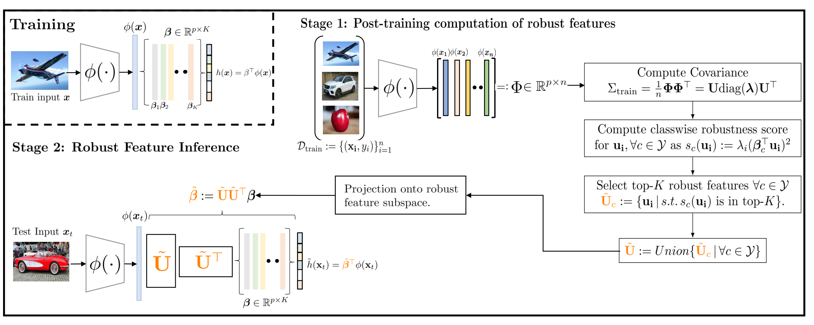
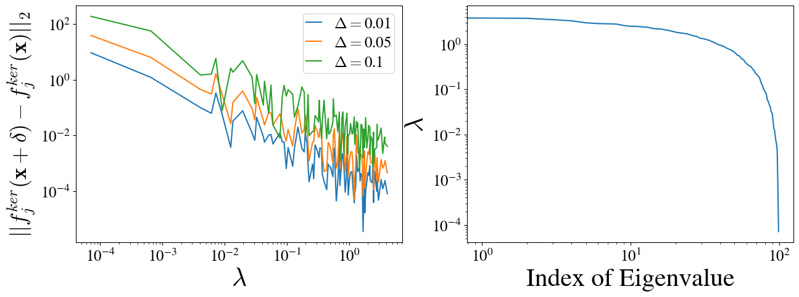
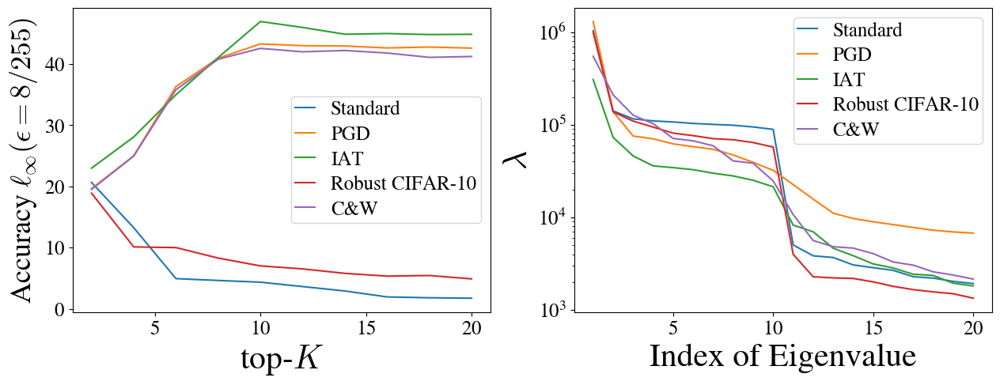

# Robust Feature Inference
This repository contains the code base for the paper "Robust Feature Inference: A Test-time Defense Strategy using Spectral Projections" accepted at TMLR 2024. 
## Table of Contents
- [Overview](#overview)
- [Installation](#installation)
- [Usage](#usage)
- [Datasets](#datasets)
- [Results](#results)
- [Contributing](#contributing)
- [Contact](#contact)
## Overview
Test-time defenses are used to improve the robustness of deep neural networks to adversarial examples during inference. However, existing methods either require an additional trained classifier to detect and correct the adversarial samples, or perform additional complex optimization on the model parameters or the input to adapt to the adversarial samples at test-time, resulting in a significant increase in the inference time compared to the base model. In this work, we propose a novel test-time defense strategy called Robust Feature Inference (RFI) that is easy to integrate with any existing (robust) training procedure without additional test-time computation. Based on the notion of robustness of features that we present, the key idea is to project the trained models to the most robust feature space, thereby reducing the vulnerability to adversarial attacks in non-robust directions. We theoretically characterize the subspace of the eigenspectrum of the feature covariance that is the most robust for a generalized additive model. 



## Installation
To install the necessary dependencies, please follow these steps:

1. Clone the repository:
    ```bash
    git clone https://github.com/anurag14/robust-feature-inference
    cd robust-feature-inference
    ```

2. Create a virtual environment:
    ```bash
    python -m venv rfi_env
    source rfi_env/bin/activate  # On Windows, use `rfi_env\Scripts\activate`
    ```

3. Install Robust Bench (https://github.com/RobustBench/robustbench) for robust bench eval. 

## Datasets
The codebase supports benchmarking on CIFAR-10, CIFAR-100 Imagenet and some more simulations.

## Results 
We show that the robust features are learned first during gradient descent dynamics as long as they are correspond to the direction of largest variance. This is done by assuming a NTK feature (more details in the paper).



Robust accuracy and eigenvalue profile in ascending order of all the methods. By truncating to K number of features at test time we improve the test time robust accuracy. 


## Contributing
We welcome contributions from the community. If you encounter any issues or have suggestions for improvements, please open an issue or submit a pull request.

## Citation
If you use our research for your research, please cite our paper:

```bibtex
@inproceedings{singh2024robust,
  title={Robust Feature Inference: A Test-time Defense Strategy using Spectral Projections},
  author={Singh, Anurag and Sabanayagam, Mahalakshmi and Muandet, Krikamol and Ghoshdastidar, Debarghya},
  booktitle={Transactions on Machine Learning Research (TMLR)})},
  year={2024}
}
```

## Contact
For any questions or inquiries, please contact the authors:
- [Anurag Singh](mailto:singh.anurag@.cispa.de)

